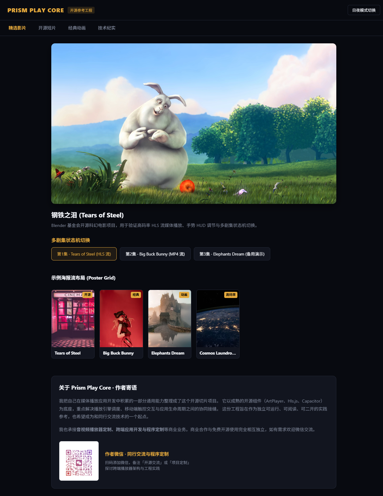
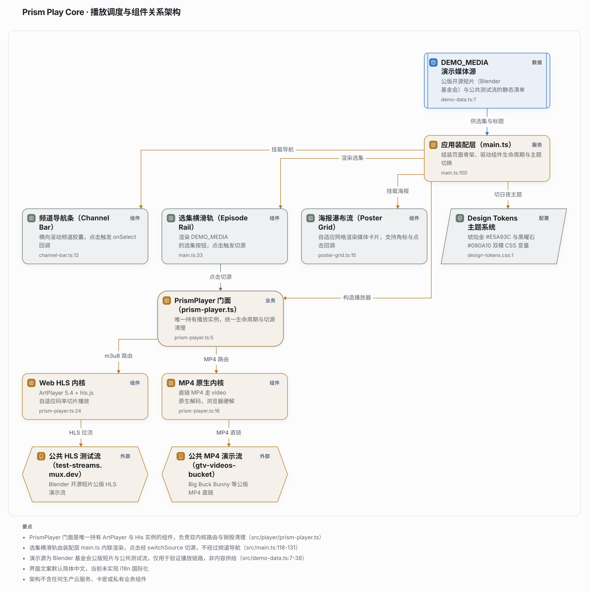

# Prism Play Core · 现代跨端流媒体播放框架

> **面向流媒体解析协同与跨端高效播放的应用工程框架与设计系统**  
> 出品：[AIOS-Lab](https://github.com/AIOS-Lab) ｜ 作者：流光逸影 ｜ 开源协议：[Apache-2.0](./LICENSE)

---

## 💡 作者寄语：为什么会有这个项目？

搞过流媒体和多媒体客户端开发的同学都知道，**在界面上找个现成的播放器把它贴出来，从来都不是真正的难点。**

真正让人掉头发的深水区在于：
1. **配合云端的流媒体解析与调度**：上游流地址瞬息万变，直链如何探测、动态鉴权如何传递、不同线路在弱网下的超时与退避重试如何设计？
2. **格式与码率自适应的接缝**：Web 端跑 HLS 切片分流，遇到高码率或特殊编码时又要无缝穿透到 Android 原生 ExoPlayer/Media3 硬解，同时还要保证画面与透明 WebView 控制层严丝合缝、不留黑边；
3. **移动端的真实交互细节**：全手势 HUD（左亮度、右音量、双击快进）、常驻选集滑轨状态同步、屏幕方向旋转联动、系统来电暂挂与后台息屏音频保活。

很多 Demo 能“播放视频”，但一放到复杂的流媒体解析场景和真机交互下就漏洞百出。我把自己在流媒体应用架构中摸爬滚打踩坑沉淀出的一整套**“云端流解析协同 + 端侧稳定起播调度”**的通用工程骨架抽离出来，形成了这份开源切片。

这份代码不是玩具，而是一份**可以独立运行、阅读和二次开发的工业级参考实现**。我希望能给需要做跨端音视频客户端的同行提供一点实打实的工程启发，也期待借此认识更多志同道合的技术朋友。

---

## 📱 真实 UI 界面展示 (Showcase)

> 以下截图为本仓库 Demo 在真实浏览器中运行的实拍画面（非示意图），公版 Blender 开源短片演示流真实播放中。

<div align="center">
  
  <p><em>▲ 院线级流媒体视觉规范：琥珀金 (#E5A93C) 与 OLED 黑曜石夜空 (#080A10) 双模体系 · 真实浏览器实拍</em></p>
</div>

---

## 🏛️ 系统架构图 (Q-Flow Architecture)

本图由 [Q-Flow](https://github.com/AIOS-Lab) 证据化架构图引擎自动生成：**每个节点与连线均锚定到仓库内的真实源码 `file:line` 锚点**，可在 `docs/qgraphflow/index.html` 离线交互查看并逐条溯源。

<div align="center">
  
</div>

### 架构关系与职责：
- **应用装配层 (`src/main.ts`)**：组装页面骨架，驱动播放器、选集横滑轨、海报流与主题切换的完整生命周期；
- **PrismPlayer 门面 (`src/player/prism-player.ts`)**：唯一持有 ArtPlayer 与 Hls.js 实例，统一生命周期、切源清理与双内核路由；
- **Web HLS 内核 / MP4 原生内核**：根据源类型自动路由——m3u8 走 MSE 切片分流，MP4 走浏览器原生硬解；
- **DEMO_MEDIA 演示媒体源 (`src/demo-data.ts`)**：公版 Blender 短片与公共测试流的静态清单，仅用于验证播放链路；
- **Design Tokens 主题系统 (`src/styles/design-tokens.css`)**：琥珀金/黑曜石双模 CSS 变量，所有组件零裸 Hex。

> **交互查看**：克隆仓库后打开 `docs/qgraphflow/index.html`，可离线缩放、按模块高亮并逐条跳转源码锚点。

> **注**：本项目界面默认语言为**简体中文**（当前未集成 i18n 国际化多语言切换）。

---

## ✨ 核心工程亮点

- 🎬 **云端流媒体解析协同架构**：解耦展示与调度，适配多线路流媒体动态注入与故障降级；
- ⚡ **双轨播放引擎调度**：Web 端原生承接 HLS/MP4 分片，支持通过 TextureView 穿透挂接 ExoPlayer/Media3 原生硬解；
- 📱 **边到边真全屏物理沉浸**：适配挖孔屏与手势导航栏，零黑边视觉拉满；
- 🎨 **工业级 Design Tokens 设计系统**：流媒体院线级琥珀金主强调色，深浅双模零裸写 Hex；
- 👆 **完整的移动端手势与选集生态**：滑动无感调节、选集自动补零与波形动效、双击防误触；
- 🛡️ **严格沙盒运行**：零敏感设备权限索取（不读相册、不读通讯录、纯粹播放器）。

---

## 🚀 本地快速启动运行

### 环境要求
- Node.js >= 18.0.0
- npm >= 9.0.0

### 安装与启动 Demo
```bash
# 1. 克隆本仓库
git clone https://github.com/AIOS-Lab/prism-play-core.git
cd prism-play-core

# 2. 安装依赖
npm install

# 3. 启动本地开发演示服务
npm run dev
```

启动后在浏览器打开 `http://localhost:3000` 即可体验：
- 自动载入公版开源流媒体短片（Blender 基金会《Tears of Steel》HLS / MP4 演示流）；
- 完整的双引擎切换、全屏控制、选集抽屉与日夜主题实时切换。

### 生产环境打包
```bash
npm run build
```

---

## 🤝 同行交流与程序定制

我也承接**音视频播放器定制、流媒体解析管线设计、跨端应用开发（Capacitor / Electron / Web）、全栈架构咨询与商业程序二次开发**等业务。

如果你有具体的技术需求、商业合作意向，或者单纯想和同行探讨流媒体播放与全栈架构心得，欢迎添加我的微信交流：

<div align="center">
  
  <p><strong>作者微信（添加请备注「开源交流」或「项目定制」）</strong></p>
</div>

> **说明**：商业合作与开源使用完全相互独立。正常学习、阅读和依照 Apache-2.0 协议使用本项目源码，无需联系我或购买任何服务。

---

## 📄 开源许可证与免责声明

- 本项目基于 [Apache License 2.0](./LICENSE) 协议开源。
- 根据协议第 6 条，任何人可自由使用和修改源码，但**严禁使用 `AIOS-Lab`、`Prism Play` 或作者的名号用于商业虚假背书与商标宣传**。
- 请在二次开发前阅读完整的 [免责与合规声明 (DISCLAIMER.md)](./DISCLAIMER.md)。
